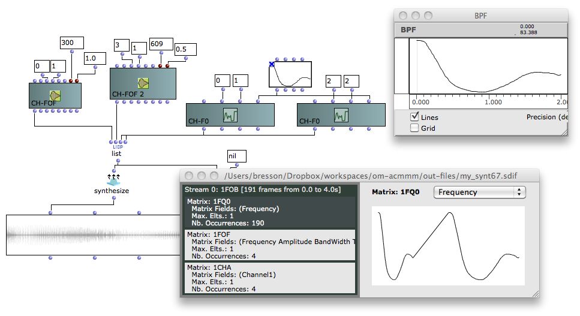

# OM-Chant

OM-Chant is an OpenMusic library for the control of the Chant synthesizer. The Chant synthesiser allows to simulate and reproduce sung voice sounds, but also in order to create more abstract sounds using the same production model.

### Documentation

A complete documentation is available here: http://support.ircam.fr/docs/om-libraries/om-chant/   
The OM-Chant library also contains a full set on tutorial patches.

***See also more information on the [projet wiki pages](https://github.com/openmusic-project/OM-Chant/wiki/), including a set of [sound examples](https://github.com/openmusic-project/OM-Chant/wiki/Examples).***

### Release / Downloads

This program is free software. It is distributed in the hope that it will be useful, but WITHOUT ANY WARRANTY, without even the implied warranty of MERCHANTABILITY or FITNESS FOR A PARTICULAR PURPOSE. 

_This library does NOT include **Chant** sources or binaries, which must be installed separately._

Get it the full OM-Chant package (including Chant binaries) here: http://forumnet.ircam.fr/shop/fr/forumnet/57-libraries-openmusic.html

### Credits

Design and developments: J. Bresson, M. Stroppa, R. Foulon (c) IRCAM 2010-2019
